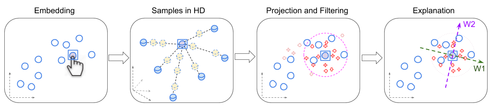

# mlteam-lime-for-tsne
MLTeam: Apply LIME for t-SNE



## TODO
+ [ ] Minh: Check stability of sampling
+ [ ] Minh: Sampling with linear combination of neighbors


## Some dev notes:
We can add some note for environment configuration, hyperparameters, tip and tricks here.

### Add submodule to github repo:

*Ref*: https://gist.github.com/gitaarik/8735255

*How to*: I want to add a repo containing all my simple, common code for any python project. This code is at the [py-common repo](https://github.com/vu-minh/py-common).

```bash
# create a folder in current repo to hold the code in `py-common`
mkdir common

# make the `py-common` repo a submodule in this current repo
git submodule add https://github.com/vu-minh/py-common.git common

# keep the code in `common` up-to-date
git submodule update
```

*Note on the stability of sampling method*:
+ Update 12/11/2019: the sampling is now *NOT STABLE*
+ The params using reproducing the samplings are:
```
iris dataset:
	seed = 1024
	sigma_HD = 0.25
    sigma_LD = 0.5

digits dataset:
	seed = 42
	sigma_HD = 0.5
    sigma_LD = 1.0

```

### Using `sample_tsne`
Goal: given a selected index of a point `selected_idx`, sample some points arround it in HD (`x_samples`) and ask tsne to calculate the embedding of these sampled points in LD (`y_samples`)

```python
# use the sample function in `sample_tsne` module
from sample_tsne import tsne_sample_embedded_points

# prepare input data `X` and tsne hyper-params
...

# select a point to sample in HD
selected_idx = np.random.randint(X.shape[0])

# create new samples in HD and embed them in LD
Y, x_samples, y_samples = tsne_sample_embedded_points(
    X,
    selected_idx=selected_idx,
    n_samples=n_samples,
    sigma_HD=sigma_HD,
    sigma_LD=sigma_LD,
    tsne_hyper_params=tsne_hyper_params,
    early_stop_hyper_params=early_stop_hyper_params,
)
```